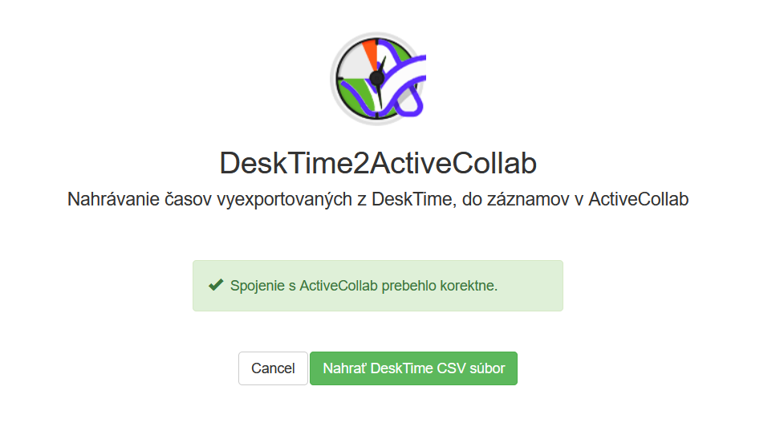
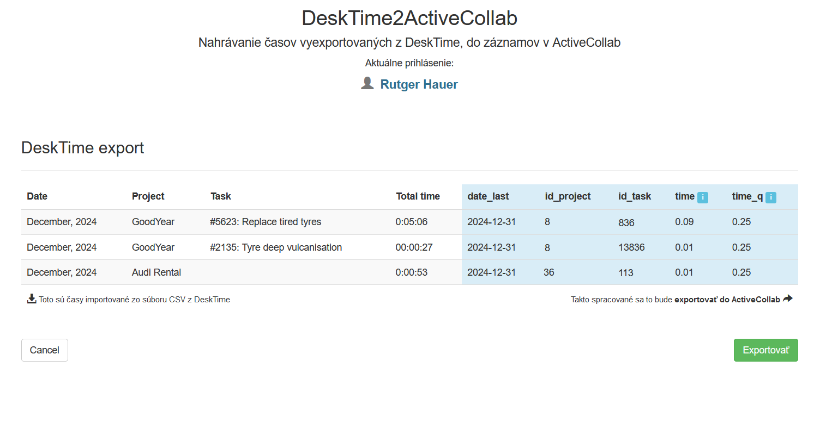
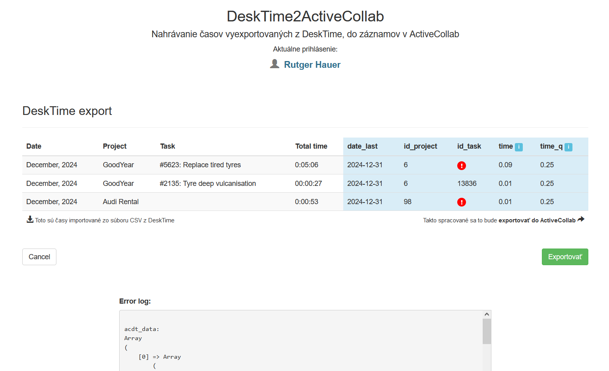

# DeskTime2ActiveCollab

Nahrávanie časov vyexportovaných z [DeskTime](https://desktime.com/), do záznamov v [ActiveCollab](https://activecollab.com/)

Potrebný súbor CSV s časmi vyexportovanými z `DeskTime > Exports > Group by > Monthly`
s nastavením `Export period: Previous month` a uložený ako `CSV` (nie XLSX).

*Denné ani týždenné nahrávania časov do ActiveCollab zatiaľ nie sú implementované.*

### Login:

Aplikácia je prispôsobená pre self-hosted ActiveCollab, preto je potrebné zadať všetky 3 údaje:
- url ActiveCollab na vlastnej inštancii
- e-mail užívateľa
- heslo užívateľa
 

### Logged-in:

Korektne zadanými údajmi sa aplikácia spojí s API ActiveCollab. S DeskTime nie je žiadna komunikácia, ani sa nevyužíva jej API.

### File upload:

Nahratím súboru CSV sa ešte neodosielajú záznamy do ActiveCollab, len sa zobrazí prehľadová tabuľka so záznamami z CSV. Exportovanie do ActiveCollab sa vykoná až priamym pokynom na stránke s tabuľkou.

### Zoznam časov z CSV

V tabuľke naľavo sa zobrazujú záznamy vyextrahované z importovaného CSV z DeskTime, a napravo sú tieto dáta konvertované do údajov ako sa budú exportovať do ActiveCollab.

V prípade že niektorý záznam z CSV nie je v úplnom súlade s dátami z ActiveCollab, zobrazia sa červené upozornenia (*pri nabehnutí kurzorom na upozornenie sa zobrazia podrobnosti*), a pod tabuľkou sa zobrazí aj výpis dát, v ktorých je možné vysledovať chybu.

Väčšinou sa môže jednať o neidentické názvy taskov, alebo task už ukončený v ActiveCollab, pre ktoré nie je možné získať ich `id`. Podobne platí aj s projektami.

### Export

Po kontrole údajov a prípadných korekciách dát v CSV, kliknutím na `Exportovať` sa odošlú údaje do API v inštancii ActiveCollab.

V tabuľke v stĺpci `Výsledok` sa v prípade neúspešného exportovania riadku, zobrazí červené upozornenie (*pri nabehnutí kurzorom na upozornenie sa zobrazia podrobnosti*).

### GDPR
- Aplikácia nijako nezbiera žiadne údaje, neukladá nič nikam ani do cookies ani do súborov (*len nutné pracovné dáta počas prihláseného užívateľa do session.
- Po odhlásení pomocou `Cancel` alebo `Hotovo` sa všetko uložené do pamäte definitívne odstráni*). Súbor s importom CSV sa tiež neukladá, len sa z neho načíta obsah.
- Nie sú využívané žiadne databázové údaje ani programy.
Okrem komunikácie s API ActiveCollab aplikácia neodosiela nikam nijaké dáta.
- Neprebieha žiadna komunikácia s DeskTime, ani s akoukoľvek treťou, štvrtou, ani nadzemskou či vesmírnou stranou  :)

### KNOWN ISSUES
- môže ešte vykazovať chybovosť pri použití v rôznych podmienkach
	* názvy projektov a taskov **neidentické v oboch prostrediach** (DeskTime vs. ActiveCollab) (BACHA: aj 2 medzery namiesto 1, alebo na konci)
	* neštandardné názvy **iné než v tvare**: "#0000: - Názov tasku"